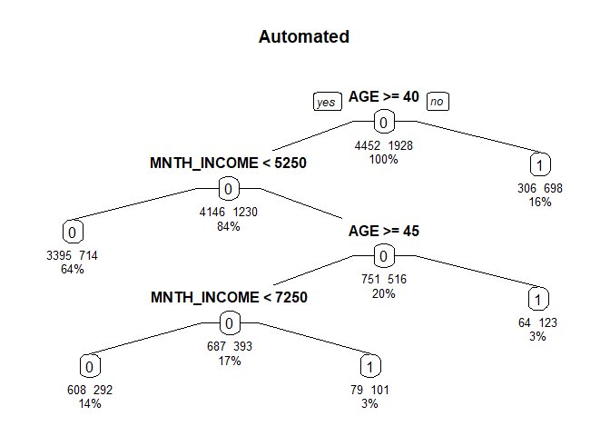

Organic Grocer1
================
Ted Dickey
12/14/2021

# Project Background

We have recently been hired by a food market company into thier
analytics department. They are interested in growing their customer base
that primarily purchases organic foods (ORGYN = 1). They have provided a
dataset with 9,114 lines of data for 7 variables. Use the data to build
a classification and regression trees modelsthat will help them best
predict who will be their customers that primarily purchase organic
foods.

# Data Dictionary

Model Variables: • “ORGYN”: 0 = primarily non-organic, 1 = primarily
organic • “GENDER”: M/F (as a factor) • “AGE” • “BILL”: Annual amount
spent in store • “CLASS”: Loyalty Status of Tin, Silver, Gold, Platinum
• “LTIME”: Time as a loyalty member, in months • “MNTH\_INCOME”:
reported monthly income

``` r
#read in Data

organ <- read.csv("Organics_Grocery.csv")
str(organ)
```

    ## 'data.frame':    9114 obs. of  7 variables:
    ##  $ ORGYN      : int  0 0 0 0 0 0 1 1 0 0 ...
    ##  $ GENDER     : chr  "F" "F" "F" "F" ...
    ##  $ AGE        : int  61 64 51 55 57 63 65 75 42 44 ...
    ##  $ BILL       : int  6669 12371 5760 10455 9422 8105 13175 6729 7874 11781 ...
    ##  $ CLASS      : chr  "Gold" "Gold" "Gold" "Gold" ...
    ##  $ LTIME      : int  8 6 3 8 8 14 5 2 2 3 ...
    ##  $ MNTH_INCOME: int  0 0 500 500 500 500 500 500 1000 1000 ...

``` r
#change 4 variables to factors
organ$GENDER <- as.factor(organ$GENDER)
organ$CLASS <- as.factor(organ$CLASS)
organ$ORGYN <- as.factor(organ$ORGYN)
```

``` r
#split into training and validation
set.seed(25)
sample.organ <- sample.split(organ$ORGYN,SplitRatio = 0.70)
train.organ <- subset(organ,sample.organ == TRUE)
test.organ <- subset(organ,sample.organ == FALSE)

options(scipen = 999)
```

``` r
#GROW TREE THEN PRUNE
treefull <- rpart(ORGYN ~ ., train.organ, method = "class", cp=-1)
#basic visual
prp(treefull)
```

    ## Warning: labs do not fit even at cex 0.15, there may be some overplotting

<!-- -->

``` r
#Print cp results
#Note due to cross-validation, CP table values will change
```

``` r
printcp(treefull)
```

    ## 
    ## Classification tree:
    ## rpart(formula = ORGYN ~ ., data = train.organ, method = "class", 
    ##     cp = -1)
    ## 
    ## Variables actually used in tree construction:
    ## [1] AGE         BILL        CLASS       GENDER      LTIME       MNTH_INCOME
    ## 
    ## Root node error: 1928/6380 = 0.30219
    ## 
    ## n= 6380 
    ## 
    ##              CP nsplit rel error  xerror     xstd
    ## 1   0.203319502      0   1.00000 1.00000 0.019025
    ## 2   0.015300830      1   0.79668 0.79668 0.017713
    ## 3   0.011410788      3   0.76608 0.77541 0.017548
    ## 4   0.009076763      4   0.75467 0.76712 0.017483
    ## 5   0.005705394      6   0.73651 0.73859 0.017251
    ## 6   0.004149378     12   0.69502 0.71732 0.017071
    ## 7   0.003112033     16   0.67842 0.70488 0.016962
    ## 8   0.002852697     17   0.67531 0.70695 0.016981
    ## 9   0.002723029     22   0.66079 0.71266 0.017030
    ## 10  0.001901798     27   0.64678 0.71058 0.017012
    ## 11  0.001728907     30   0.64108 0.70799 0.016990
    ## 12  0.001556017     36   0.63071 0.70228 0.016940
    ## 13  0.001383126     38   0.62759 0.70747 0.016985
    ## 14  0.001296680     45   0.61774 0.70851 0.016994
    ## 15  0.001210235     49   0.61255 0.70902 0.016999
    ## 16  0.001037344     61   0.59647 0.71940 0.017088
    ## 17  0.000864454     71   0.58610 0.72407 0.017128
    ## 18  0.000778008     74   0.58351 0.73185 0.017194
    ## 19  0.000691563     84   0.57521 0.73288 0.017203
    ## 20  0.000518672     90   0.57106 0.73288 0.017203
    ## 21  0.000461042    103   0.56432 0.76037 0.017429
    ## 22  0.000444576    114   0.55913 0.76400 0.017458
    ## 23  0.000389004    123   0.55498 0.76556 0.017470
    ## 24  0.000345781    138   0.54720 0.76712 0.017483
    ## 25  0.000259336    151   0.54201 0.77697 0.017561
    ## 26  0.000207469    159   0.53994 0.78734 0.017641
    ## 27  0.000172891    167   0.53786 0.79979 0.017736
    ## 28  0.000129668    173   0.53683 0.80187 0.017752
    ## 29  0.000086445    187   0.53475 0.81120 0.017821
    ## 30  0.000064834    193   0.53423 0.81172 0.017825
    ## 31  0.000051867    201   0.53371 0.81224 0.017829
    ## 32  0.000000000    211   0.53320 0.81276 0.017833
    ## 33 -1.000000000    446   0.53320 0.81276 0.017833

``` r
#to print the lowest xerror cp value
treefull$cptable[which.min(treefull$cptable[,"xerror"]),"CP"]
```

    ## [1] 0.001556017

``` r
#can also print a visual
plotcp(treefull)
```

<!-- -->

``` r
#rerun with new cp and create visualizations
treefull2 <- prune(treefull, cp=0.004149)
treefull3 <- prune(treefull, cp=0.001556)
prp(treefull2, type = 1, extra = 101, under = TRUE, split.font = 2, varlen = -15)
```

<!-- -->

``` r
prp(treefull3, type = 1, extra = 101, under = TRUE, split.font = 2, varlen = -15)
```

<!-- -->

``` r
#create predictions & Confusion matrix for pruned tree using cp method
predict.treefull2 <- predict(treefull2, test.organ, type = 'class')
confusionMatrix(predict.treefull2, test.organ$ORGYN, positive = "1")
```

    ## Confusion Matrix and Statistics
    ## 
    ##           Reference
    ## Prediction    0    1
    ##          0 1663  373
    ##          1  245  453
    ##                                                
    ##                Accuracy : 0.774                
    ##                  95% CI : (0.7578, 0.7895)     
    ##     No Information Rate : 0.6979               
    ##     P-Value [Acc > NIR] : < 0.00000000000000022
    ##                                                
    ##                   Kappa : 0.4393               
    ##                                                
    ##  Mcnemar's Test P-Value : 0.0000003244         
    ##                                                
    ##             Sensitivity : 0.5484               
    ##             Specificity : 0.8716               
    ##          Pos Pred Value : 0.6490               
    ##          Neg Pred Value : 0.8168               
    ##              Prevalence : 0.3021               
    ##          Detection Rate : 0.1657               
    ##    Detection Prevalence : 0.2553               
    ##       Balanced Accuracy : 0.7100               
    ##                                                
    ##        'Positive' Class : 1                    
    ## 

``` r
predict.treefull3 <- predict(treefull3, test.organ, type = 'class')
confusionMatrix(predict.treefull3, test.organ$ORGYN, positive = "1")
```

    ## Confusion Matrix and Statistics
    ## 
    ##           Reference
    ## Prediction    0    1
    ##          0 1708  408
    ##          1  200  418
    ##                                                
    ##                Accuracy : 0.7776               
    ##                  95% CI : (0.7616, 0.7931)     
    ##     No Information Rate : 0.6979               
    ##     P-Value [Acc > NIR] : < 0.00000000000000022
    ##                                                
    ##                   Kappa : 0.4321               
    ##                                                
    ##  Mcnemar's Test P-Value : < 0.00000000000000022
    ##                                                
    ##             Sensitivity : 0.5061               
    ##             Specificity : 0.8952               
    ##          Pos Pred Value : 0.6764               
    ##          Neg Pred Value : 0.8072               
    ##              Prevalence : 0.3021               
    ##          Detection Rate : 0.1529               
    ##    Detection Prevalence : 0.2260               
    ##       Balanced Accuracy : 0.7006               
    ##                                                
    ##        'Positive' Class : 1                    
    ## 

``` r
#Calculate the AUC
fit.pr2 <- predict(treefull2, test.organ, type="prob")[,2]
fit.pred2 <- prediction(fit.pr2,test.organ$ORGYN)
fit.perf2 <- performance(fit.pred2, "tpr","fpr")
plot(fit.perf2,lwd=2,col="blue",
     main="ROC")
abline(a=0,b=1)
```

<!-- -->

``` r
auc2 <- performance(fit.pred2, measure = "auc")
print(auc2 <- auc2@y.values[[1]])
```

    ## [1] 0.77832

``` r
fit.pr3 <- predict(treefull3, test.organ, type="prob")[,2]
fit.pred3 <- prediction(fit.pr3,test.organ$ORGYN)
fit.perf3 <- performance(fit.pred3, "tpr","fpr")
plot(fit.perf3,lwd=2,col="blue",
     main="ROC")
abline(a=0,b=1)
```

<!-- -->

``` r
auc3 <- performance(fit.pred3, measure = "auc")
print(auc3 <- auc3@y.values[[1]])
```

    ## [1] 0.7819925

``` r
#AUTOMATED METHOD
treeAuto <- rpart(ORGYN ~ ., train.organ, method = "class")
prp(treeAuto, type = 1, extra = 101, under = TRUE, split.font = 2, varlen = -15, main= "Automated")
```

<!-- -->

``` r
print(treeAuto)
```

    ## n= 6380 
    ## 
    ## node), split, n, loss, yval, (yprob)
    ##       * denotes terminal node
    ## 
    ##  1) root 6380 1928 0 (0.6978056 0.3021944)  
    ##    2) AGE>=39.5 5376 1230 0 (0.7712054 0.2287946)  
    ##      4) MNTH_INCOME< 5250 4109  714 0 (0.8262351 0.1737649) *
    ##      5) MNTH_INCOME>=5250 1267  516 0 (0.5927388 0.4072612)  
    ##       10) AGE>=44.5 1080  393 0 (0.6361111 0.3638889)  
    ##         20) MNTH_INCOME< 7250 900  292 0 (0.6755556 0.3244444) *
    ##         21) MNTH_INCOME>=7250 180   79 1 (0.4388889 0.5611111) *
    ##       11) AGE< 44.5 187   64 1 (0.3422460 0.6577540) *
    ##    3) AGE< 39.5 1004  306 1 (0.3047809 0.6952191) *

``` r
predict.treeAuto <- predict(treeAuto, test.organ, type = 'class')
confusionMatrix(predict.treeAuto, test.organ$ORGYN, positive = "1")
```

    ## Confusion Matrix and Statistics
    ## 
    ##           Reference
    ## Prediction    0    1
    ##          0 1693  444
    ##          1  215  382
    ##                                                
    ##                Accuracy : 0.759                
    ##                  95% CI : (0.7425, 0.7749)     
    ##     No Information Rate : 0.6979               
    ##     P-Value [Acc > NIR] : 0.0000000000007094   
    ##                                                
    ##                   Kappa : 0.3796               
    ##                                                
    ##  Mcnemar's Test P-Value : < 0.00000000000000022
    ##                                                
    ##             Sensitivity : 0.4625               
    ##             Specificity : 0.8873               
    ##          Pos Pred Value : 0.6399               
    ##          Neg Pred Value : 0.7922               
    ##              Prevalence : 0.3021               
    ##          Detection Rate : 0.1397               
    ##    Detection Prevalence : 0.2184               
    ##       Balanced Accuracy : 0.6749               
    ##                                                
    ##        'Positive' Class : 1                    
    ## 

``` r
#Calculate the AUC
fit.prAuto <- predict(treeAuto, test.organ, type="prob")[,2]
fit.predAuto <- prediction(fit.prAuto,test.organ$ORGYN)
fit.perfAuto <- performance(fit.predAuto, "tpr","fpr")
plot(fit.perfAuto,lwd=2,col="blue",
     main="ROC")
abline(a=0,b=1)
```

<!-- -->

``` r
aucAuto <- performance(fit.predAuto, measure = "auc")
print(aucAuto <- aucAuto@y.values[[1]])
```

    ## [1] 0.7093444

## Entropy

``` r
#entropy Full
treefull.inf <- rpart(ORGYN ~ ., train.organ, method = "class", cp=-1, parms = list(split = "information"))
printcp(treefull.inf)
```

    ## 
    ## Classification tree:
    ## rpart(formula = ORGYN ~ ., data = train.organ, method = "class", 
    ##     parms = list(split = "information"), cp = -1)
    ## 
    ## Variables actually used in tree construction:
    ## [1] AGE         BILL        CLASS       GENDER      LTIME       MNTH_INCOME
    ## 
    ## Root node error: 1928/6380 = 0.30219
    ## 
    ## n= 6380 
    ## 
    ##              CP nsplit rel error  xerror     xstd
    ## 1   0.203319502      0   1.00000 1.00000 0.019025
    ## 2   0.015300830      1   0.79668 0.81587 0.017856
    ## 3   0.011410788      3   0.76608 0.76712 0.017483
    ## 4   0.009076763      4   0.75467 0.76089 0.017433
    ## 5   0.008558091      6   0.73651 0.73911 0.017255
    ## 6   0.005705394      9   0.70643 0.72873 0.017168
    ## 7   0.004149378     11   0.69502 0.71266 0.017030
    ## 8   0.002852697     15   0.67842 0.70747 0.016985
    ## 9   0.002723029     20   0.66390 0.70643 0.016976
    ## 10  0.001901798     25   0.64990 0.70280 0.016944
    ## 11  0.001728907     28   0.64419 0.71369 0.017039
    ## 12  0.001556017     34   0.63382 0.71784 0.017075
    ## 13  0.001383126     36   0.63071 0.72095 0.017102
    ## 14  0.001296680     43   0.62085 0.71421 0.017044
    ## 15  0.001210235     47   0.61566 0.71525 0.017053
    ## 16  0.001037344     59   0.60062 0.72251 0.017115
    ## 17  0.000778008     65   0.59440 0.71888 0.017084
    ## 18  0.000691563     92   0.56691 0.72873 0.017168
    ## 19  0.000648340     98   0.56276 0.73755 0.017242
    ## 20  0.000518672    102   0.56017 0.73755 0.017242
    ## 21  0.000453838    124   0.54824 0.74378 0.017294
    ## 22  0.000389004    132   0.54461 0.75156 0.017357
    ## 23  0.000259336    144   0.53994 0.76089 0.017433
    ## 24  0.000172891    152   0.53786 0.77801 0.017569
    ## 25  0.000148192    169   0.53475 0.78527 0.017625
    ## 26  0.000129668    176   0.53371 0.79305 0.017685
    ## 27  0.000086445    183   0.53268 0.79564 0.017705
    ## 28  0.000064834    189   0.53216 0.79824 0.017724
    ## 29  0.000000000    205   0.53112 0.80031 0.017740
    ## 30 -1.000000000    444   0.53112 0.80031 0.017740

``` r
treefull.inf$cptable[which.min(treefull.inf$cptable[,"xerror"]),"CP"]
```

    ## [1] 0.001901798

``` r
plotcp(treefull.inf)
```

<!-- -->

``` r
#Entropy full with new cp
treefull.inf1<- prune(treefull.inf, cp=0.0028, parms = list(split = "information"))
treefull.inf2 <- prune(treefull.inf, cp=0.0022, parms = list(split = "information"))
prp(treefull.inf1, type = 1, extra = 101, under = TRUE, split.font = 2, varlen = -15)
```

<!-- -->

``` r
prp(treefull.inf2, type = 1, extra = 101, under = TRUE, split.font = 2, varlen = -15)
```

<!-- -->

``` r
predict.treefull1.inf1 <- predict(treefull.inf1, test.organ, type = 'class')
confusionMatrix(predict.treefull1.inf1, test.organ$ORGYN, positive = "1")
```

    ## Confusion Matrix and Statistics
    ## 
    ##           Reference
    ## Prediction    0    1
    ##          0 1693  390
    ##          1  215  436
    ##                                                
    ##                Accuracy : 0.7787               
    ##                  95% CI : (0.7627, 0.7942)     
    ##     No Information Rate : 0.6979               
    ##     P-Value [Acc > NIR] : < 0.00000000000000022
    ##                                                
    ##                   Kappa : 0.4417               
    ##                                                
    ##  Mcnemar's Test P-Value : 0.000000000001504    
    ##                                                
    ##             Sensitivity : 0.5278               
    ##             Specificity : 0.8873               
    ##          Pos Pred Value : 0.6697               
    ##          Neg Pred Value : 0.8128               
    ##              Prevalence : 0.3021               
    ##          Detection Rate : 0.1595               
    ##    Detection Prevalence : 0.2381               
    ##       Balanced Accuracy : 0.7076               
    ##                                                
    ##        'Positive' Class : 1                    
    ## 

``` r
predict.treefull1.inf2 <- predict(treefull.inf2, test.organ, type = 'class')
confusionMatrix(predict.treefull1.inf2, test.organ$ORGYN, positive = "1")
```

    ## Confusion Matrix and Statistics
    ## 
    ##           Reference
    ## Prediction    0    1
    ##          0 1708  411
    ##          1  200  415
    ##                                                
    ##                Accuracy : 0.7765               
    ##                  95% CI : (0.7604, 0.792)      
    ##     No Information Rate : 0.6979               
    ##     P-Value [Acc > NIR] : < 0.00000000000000022
    ##                                                
    ##                   Kappa : 0.4286               
    ##                                                
    ##  Mcnemar's Test P-Value : < 0.00000000000000022
    ##                                                
    ##             Sensitivity : 0.5024               
    ##             Specificity : 0.8952               
    ##          Pos Pred Value : 0.6748               
    ##          Neg Pred Value : 0.8060               
    ##              Prevalence : 0.3021               
    ##          Detection Rate : 0.1518               
    ##    Detection Prevalence : 0.2249               
    ##       Balanced Accuracy : 0.6988               
    ##                                                
    ##        'Positive' Class : 1                    
    ## 

``` r
#Calculate the AUC
fit.prInf1 <- predict(treefull.inf1, test.organ, type="prob")[,2]
fit.predInf1 <- prediction(fit.prInf1,test.organ$ORGYN)
fit.perfInf1 <- performance(fit.predInf1, "tpr","fpr")
plot(fit.perfInf1,lwd=2,col="blue",
     main="ROC")
abline(a=0,b=1)
```

<!-- -->

``` r
aucInf1 <- performance(fit.predInf1, measure = "auc")
print(aucInf1 <- aucInf1@y.values[[1]])
```

    ## [1] 0.7559863

``` r
fit.prInf2 = predict(treefull.inf2, test.organ, type="prob")[,2]
fit.predInf2 = prediction(fit.prInf2,test.organ$ORGYN)
fit.perfInf2 = performance(fit.predInf2, "tpr","fpr")
plot(fit.perfInf2,lwd=2,col="blue",
     main="ROC")
abline(a=0,b=1)
```

<!-- -->

``` r
aucInf2 <- performance(fit.predInf2, measure = "auc")
print(aucInf2 <- aucInf2@y.values[[1]])
```

    ## [1] 0.7548839

``` r
#entropy automated
#Clear plots or you may get some warning messages
tree.inf <- rpart(ORGYN ~ ., train.organ, method = "class", parms = list(split = "information"))
prp(tree.inf, type = 1, extra = 101, under = TRUE, split.font = 2, varlen = -15, main= "Automated Entropy")
```

<!-- -->

``` r
print(tree.inf)
```

    ## n= 6380 
    ## 
    ## node), split, n, loss, yval, (yprob)
    ##       * denotes terminal node
    ## 
    ##  1) root 6380 1928 0 (0.6978056 0.3021944)  
    ##    2) AGE>=39.5 5376 1230 0 (0.7712054 0.2287946)  
    ##      4) MNTH_INCOME< 5250 4109  714 0 (0.8262351 0.1737649) *
    ##      5) MNTH_INCOME>=5250 1267  516 0 (0.5927388 0.4072612)  
    ##       10) AGE>=44.5 1080  393 0 (0.6361111 0.3638889)  
    ##         20) MNTH_INCOME< 7250 900  292 0 (0.6755556 0.3244444) *
    ##         21) MNTH_INCOME>=7250 180   79 1 (0.4388889 0.5611111) *
    ##       11) AGE< 44.5 187   64 1 (0.3422460 0.6577540) *
    ##    3) AGE< 39.5 1004  306 1 (0.3047809 0.6952191) *

``` r
predict.tree.inf <- predict(tree.inf, test.organ, type = 'class')
confusionMatrix(predict.tree.inf, test.organ$ORGYN, positive = "1")
```

    ## Confusion Matrix and Statistics
    ## 
    ##           Reference
    ## Prediction    0    1
    ##          0 1693  444
    ##          1  215  382
    ##                                                
    ##                Accuracy : 0.759                
    ##                  95% CI : (0.7425, 0.7749)     
    ##     No Information Rate : 0.6979               
    ##     P-Value [Acc > NIR] : 0.0000000000007094   
    ##                                                
    ##                   Kappa : 0.3796               
    ##                                                
    ##  Mcnemar's Test P-Value : < 0.00000000000000022
    ##                                                
    ##             Sensitivity : 0.4625               
    ##             Specificity : 0.8873               
    ##          Pos Pred Value : 0.6399               
    ##          Neg Pred Value : 0.7922               
    ##              Prevalence : 0.3021               
    ##          Detection Rate : 0.1397               
    ##    Detection Prevalence : 0.2184               
    ##       Balanced Accuracy : 0.6749               
    ##                                                
    ##        'Positive' Class : 1                    
    ## 

``` r
#Calculate the AUC
fit.prInfA <- predict(tree.inf, test.organ, type="prob")[,2]
fit.predInfA <- prediction(fit.prInfA,test.organ$ORGYN)
fit.perfInfA <- performance(fit.predInfA, "tpr","fpr")
plot(fit.perfInfA,lwd=2,col="blue",
     main="ROC")
abline(a=0,b=1)
```

<!-- -->

``` r
aucInfA <- performance(fit.predInfA, measure = "auc")
print(aucInfA <- aucInfA@y.values[[1]])
```

    ## [1] 0.7093444

``` r
#Random Forest
#Note: technically you do not need cross-validation wih random forest
#But, because we are planing to compare it to other models, we must keep it apples-to-apples
rf.organ <- randomForest(ORGYN ~., train.organ, importance = TRUE)
#variable importance
varImpPlot(rf.organ, type = 1)
```

<!-- -->

``` r
importance(rf.organ, type = 1)
```

    ##             MeanDecreaseAccuracy
    ## GENDER                  8.489179
    ## AGE                   127.912598
    ## BILL                   30.359309
    ## CLASS                  24.822968
    ## LTIME                  21.913879
    ## MNTH_INCOME            76.347390

``` r
#predictions
rf.pred <- predict(rf.organ, test.organ)
confusionMatrix(rf.pred, test.organ$ORGYN, positive = "1")
```

    ## Confusion Matrix and Statistics
    ## 
    ##           Reference
    ## Prediction    0    1
    ##          0 1699  420
    ##          1  209  406
    ##                                                
    ##                Accuracy : 0.7699               
    ##                  95% CI : (0.7537, 0.7856)     
    ##     No Information Rate : 0.6979               
    ##     P-Value [Acc > NIR] : < 0.00000000000000022
    ##                                                
    ##                   Kappa : 0.4118               
    ##                                                
    ##  Mcnemar's Test P-Value : < 0.00000000000000022
    ##                                                
    ##             Sensitivity : 0.4915               
    ##             Specificity : 0.8905               
    ##          Pos Pred Value : 0.6602               
    ##          Neg Pred Value : 0.8018               
    ##              Prevalence : 0.3021               
    ##          Detection Rate : 0.1485               
    ##    Detection Prevalence : 0.2249               
    ##       Balanced Accuracy : 0.6910               
    ##                                                
    ##        'Positive' Class : 1                    
    ## 

``` r
#Calculate the AUC
fit.prRF <- predict(rf.organ, test.organ, type="prob")[,2]
fit.predRF <- prediction(fit.prRF,test.organ$ORGYN)
fit.perfRF <- performance(fit.predRF, "tpr","fpr")
plot(fit.perfRF,lwd=2,col="blue",
     main="ROC")
abline(a=0,b=1)
```

<!-- -->

``` r
aucRF <- performance(fit.predRF, measure = "auc")
print(aucRF <- aucRF@y.values[[1]])
```

    ## [1] 0.7839633

``` r
#Boosted & Predictions
boost.organ <- boosting(ORGYN ~ . , data = train.organ)
boost.pred <- predict(boost.organ, test.organ)
confusionMatrix(as.factor(boost.pred$class), as.factor(test.organ$ORGYN), positive = "1")
```

    ## Confusion Matrix and Statistics
    ## 
    ##           Reference
    ## Prediction    0    1
    ##          0 1733  410
    ##          1  175  416
    ##                                                
    ##                Accuracy : 0.786                
    ##                  95% CI : (0.7702, 0.8013)     
    ##     No Information Rate : 0.6979               
    ##     P-Value [Acc > NIR] : < 0.00000000000000022
    ##                                                
    ##                   Kappa : 0.4481               
    ##                                                
    ##  Mcnemar's Test P-Value : < 0.00000000000000022
    ##                                                
    ##             Sensitivity : 0.5036               
    ##             Specificity : 0.9083               
    ##          Pos Pred Value : 0.7039               
    ##          Neg Pred Value : 0.8087               
    ##              Prevalence : 0.3021               
    ##          Detection Rate : 0.1522               
    ##    Detection Prevalence : 0.2162               
    ##       Balanced Accuracy : 0.7060               
    ##                                                
    ##        'Positive' Class : 1                    
    ## 

``` r
#Calculate the AUC
fit.prB <- boost.pred$prob[,2]
fit.predB <- prediction(fit.prB,as.factor(test.organ$ORGYN))
fit.perfB <- performance(fit.predB, "tpr","fpr")
plot(fit.perfB,lwd=2,col="blue",
     main="ROC")
abline(a=0,b=1)
```

<!-- -->

``` r
aucB <- performance(fit.predB, measure = "auc")
print(aucB <- aucB@y.values[[1]])
```

    ## [1] 0.8116653
